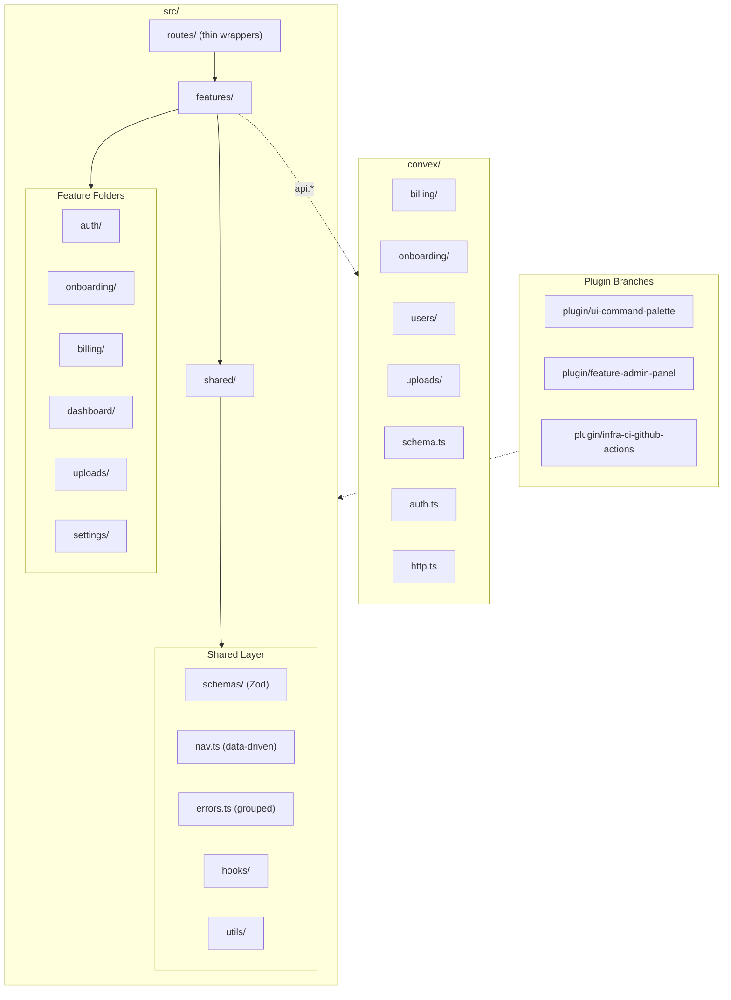

# Feather Starter (Convex)

A production-ready SaaS starter kit built with React 19, Convex, TanStack Router/Query/Form, Zod v4, Tailwind v4, and Stripe. Feature-folder architecture with shared validation, git-branch plugin system, CLI generators, and full i18n support.

## Architecture



## Tech Stack

| Layer | Technology | Version |
|-------|-----------|---------|
| UI Framework | React | 19 |
| Backend | Convex | 1.32+ |
| Routing | TanStack Router | 1.166+ |
| Data Fetching | TanStack Query + @convex-dev/react-query | 5.90+ |
| Forms | TanStack Form | 1.28+ |
| Validation | Zod | 4.3+ (v4) |
| Styling | Tailwind CSS | 4.2+ |
| i18n | i18next + react-i18next | 23+ |
| Payments | Stripe | 16+ |
| Email | Resend + React Email | 6+ |
| Testing | Vitest + Testing Library + convex-test | 4+ |
| Generators | Plop.js | 4+ |

## Directory Structure

```
feather-starter-convex/
  convex/                    # Convex backend
    billing/                 #   Stripe integration, plans, subscriptions
    onboarding/              #   Username setup mutation
    uploads/                 #   File upload mutations
    users/                   #   User queries and mutations
    email/                   #   React Email templates
    otp/                     #   OTP email sender (Resend)
    auth.ts                  #   Auth configuration
    schema.ts                #   Database schema
    http.ts                  #   HTTP routes (webhooks)
  src/
    features/                # Feature folders
      auth/                  #   Login UI (minimal -- login page is a route)
      billing/               #   Checkout page, billing settings
      dashboard/             #   Dashboard page, navigation shell
      onboarding/            #   Username setup page
      settings/              #   Settings page (general + billing tabs)
      uploads/               #   File upload (embedded in settings)
    routes/                  # TanStack Router (thin wrappers)
      _app/_auth/dashboard/  #   Authenticated dashboard routes
      _app/login/            #   Public login route
    shared/                  # Cross-feature code
      schemas/               #   Zod schemas (username, billing)
      errors.ts              #   Feature-grouped error constants
      nav.ts                 #   Data-driven navigation items
      hooks/                 #   Shared React hooks
      utils/                 #   Utility functions
    ui/                      # shadcn/ui components
  templates/                 # Plop.js Handlebars templates
  scripts/                   # Shell scripts
    plugin.sh                #   Plugin management (list/preview/install)
  public/locales/            # i18n translation files (en/, es/)
```

## Features

### Auth
Email OTP and GitHub OAuth login via `@convex-dev/auth`. The login page is a route-level component. Auth state is available throughout the app via `convex/users/queries.ts:getCurrentUser`.

### Onboarding
Post-signup username selection with Zod-validated input (max 20 chars). Creates a Stripe customer on completion. Frontend in `src/features/onboarding/`, backend in `convex/onboarding/`.

### Billing
Stripe subscription billing with free/pro plans, monthly/yearly intervals, USD/EUR currencies. Includes checkout page, billing settings with plan display and cancellation. Backend handles webhook events for subscription lifecycle. See `convex/billing/` for all Stripe integration.

### Dashboard
Main authenticated area with data-driven navigation (tab bar from `src/shared/nav.ts`). The dashboard shell (`_layout.tsx`) wraps all authenticated routes.

### Settings
User profile settings with avatar upload, username editing, and billing tab. Uses TanStack Form with Zod validation. Avatar uploads use `@xixixao/uploadstuff` with Convex storage.

### Uploads
File upload functionality using Convex's built-in storage. Currently embedded in the settings feature for avatar uploads. Backend mutations in `convex/uploads/mutations.ts`.

## Getting Started

### Prerequisites

- Node.js 18+
- npm
- A Convex account (free at [convex.dev](https://convex.dev))

### Setup

1. Install dependencies:
   ```sh
   npm install
   ```

2. Set up Convex:
   ```sh
   npx convex dev --configure=new --once
   npx @convex-dev/auth
   ```

3. Configure environment variables in the Convex dashboard:
   ```sh
   # Email (Resend)
   npx convex env set AUTH_RESEND_KEY re_...

   # Stripe
   npx convex env set STRIPE_SECRET_KEY sk_test_...
   npx convex env set STRIPE_WEBHOOK_SECRET whsec_...

   # GitHub OAuth (optional)
   npx convex env set AUTH_GITHUB_ID ...
   npx convex env set AUTH_GITHUB_SECRET ...
   ```

4. Start the dev server:
   ```sh
   npm start
   ```
   Opens at [http://localhost:5173](http://localhost:5173).

## Plugin System

Plugins are git branches that add features to the starter kit. Each plugin branch contains self-contained changes that merge cleanly into main.

### Available Plugins

| Plugin | Branch | What it adds |
|--------|--------|-------------|
| Command Palette | `plugin/ui-command-palette` | Cmd+K command palette with cmdk, keyboard navigation, i18n |
| Admin Panel | `plugin/feature-admin-panel` | User management CRUD, role system, admin route guard |
| CI Workflows | `plugin/infra-ci-github-actions` | Auto-rebase on main push, CI checks on plugin branches |

### Plugin Management

```sh
# List available plugins
bash scripts/plugin.sh list

# Preview what a plugin changes
bash scripts/plugin.sh preview plugin/ui-command-palette

# Install a plugin (merges into current branch)
bash scripts/plugin.sh install plugin/feature-admin-panel
```

### Creating a Plugin

1. Create a branch from main: `git checkout -b plugin/your-plugin-name`
2. Add your feature files in `src/features/your-feature/`
3. Add backend functions in `convex/your-feature/` if needed
4. Add i18n namespace in `src/i18n.ts` and translation files in `public/locales/`
5. Append to `src/shared/nav.ts` if adding navigation
6. Add error constants to `src/shared/errors.ts` if needed
7. Commit and push

Plugin extension points (append-only, minimal merge conflicts):
- `src/shared/nav.ts` -- navigation items array
- `src/shared/errors.ts` -- error constant groups
- `src/i18n.ts` -- namespace list

## Generators

Four CLI generators scaffold new code following project conventions.

### Feature Generator

Scaffolds a full feature with frontend components, hooks, tests, and Convex backend functions.

```sh
npm run gen:feature
# Prompts for: name (kebab-case)
# Creates:
#   src/features/{name}/components/{PascalName}Page.tsx
#   src/features/{name}/hooks/use{PascalName}.ts
#   src/features/{name}/index.ts
#   src/features/{name}/{name}.test.tsx
#   src/features/{name}/README.md
#   convex/{name}/queries.ts
#   convex/{name}/mutations.ts
```

### Route Generator

Creates a TanStack Router route file with optional auth guard.

```sh
npm run gen:route
# Prompts for: name (kebab-case), authRequired (y/n)
# Creates:
#   src/routes/_app/_auth/{name}.tsx  (if auth required)
#   src/routes/_app/{name}.tsx        (if public)
```

### Convex Function Generator

Generates a typed Convex query, mutation, or action.

```sh
npm run gen:convex-function
# Prompts for: domain, type (query/mutation/action), name
# Creates:
#   convex/{domain}/queries.ts   (or mutations.ts or actions.ts)
#   Skips if file already exists
```

### Form Generator

Generates a Zod validation schema and TanStack Form component.

```sh
npm run gen:form
# Prompts for: name (kebab-case), feature (target feature folder)
# Creates:
#   src/shared/schemas/{name}.ts
#   src/features/{feature}/components/{PascalName}Form.tsx
```

## Shared Schemas

Zod v4 schemas in `src/shared/schemas/` are the single source of truth for validation, shared between frontend forms and Convex mutations.

| Schema | File | Exports |
|--------|------|---------|
| Username | `schemas/username.ts` | `username` schema, `USERNAME_MAX_LENGTH` |
| Billing | `schemas/billing.ts` | `currency`, `interval`, `planKey` schemas with type exports |

Convex mutations use `convex-helpers/server/zod4` (`zCustomMutation`, `zodToConvex`) to validate with the same Zod schemas.

## Internationalization

Translations live in `public/locales/{lang}/{namespace}.json`. Supported languages: English (`en`), Spanish (`es`).

Each feature has its own i18n namespace (e.g., `dashboard`, `billing`, `settings`). Components use `useTranslation("namespace")` to load translations.

To add a language: create new locale files in `public/locales/{lang}/` for each namespace.

## Testing

```sh
npm test              # Run all tests
npm run test:watch    # Watch mode
```

Tests are co-located with their features (`*.test.tsx` / `*.test.ts`). Frontend tests use Testing Library with a custom `renderWithRouter` helper. Backend tests use `convex-test` with the `feather-testing-convex` helper library.

Coverage excludes route files (thin wrappers) and barrel exports.

## Deployment

1. Build: `npm run build`
2. Deploy Convex: `npx convex deploy`
3. Deploy frontend to any static host (Vercel, Netlify, Cloudflare Pages)
4. Set `VITE_CONVEX_URL` in your hosting provider

## Vendor Documentation

See [PROVIDERS.md](./PROVIDERS.md) for detailed documentation on every external service, including swap guides for replacing any vendor.

## License

MIT
